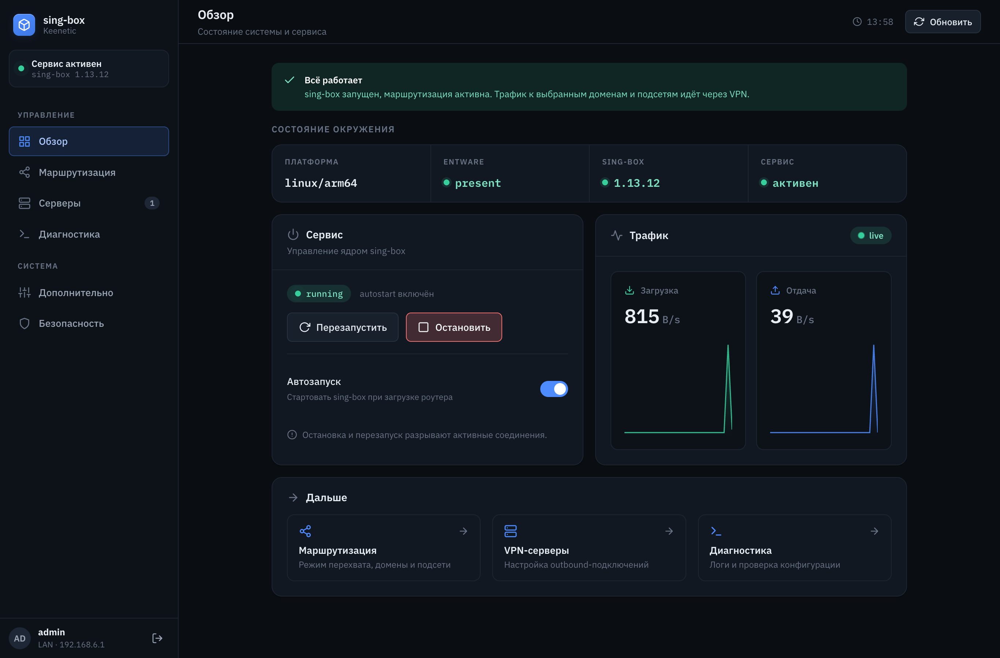
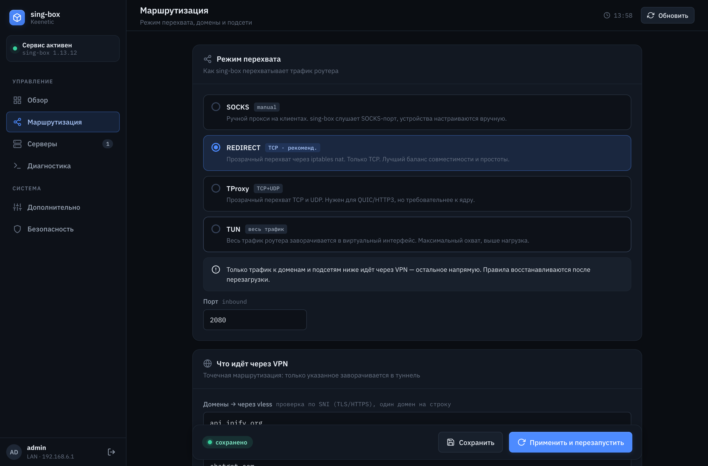
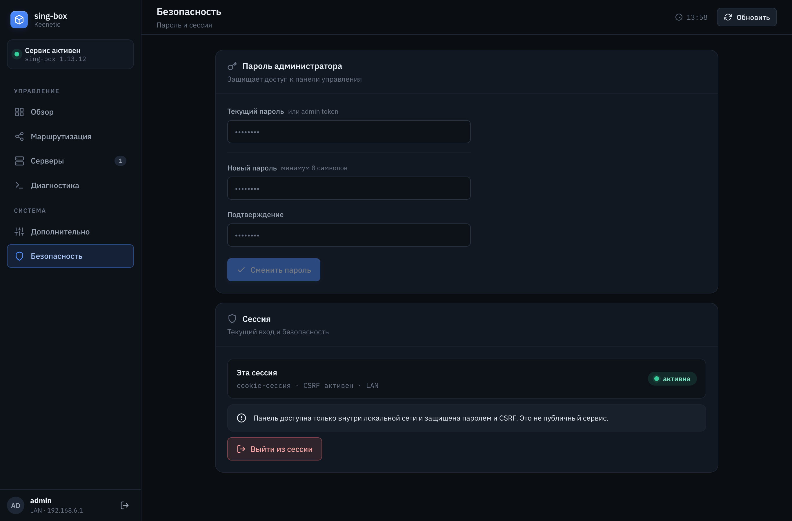

# keenetic-sing-box-ui

[](https://github.com/CoOre/keenetic-sing-box-ui/actions/workflows/ci.yml)
[](https://github.com/CoOre/keenetic-sing-box-ui/releases)
[](LICENSE)


Веб-интерфейс для управления [sing-box](https://github.com/SagerNet/sing-box) на
роутерах **Keenetic** (Entware, архитектура aarch64). Один статически
слинкованный Go-бинарник со встроенным фронтендом (Svelte) — без внешних
зависимостей на роутере.

Возможности:

- управление серверами/outbound'ами (импорт share-ссылок, проверка конфига);
- сборка и применение конфигурации sing-box;
- прозрачный проксинг с селективной маршрутизацией по доменам и CIDR:
  **TProxy** (TCP+UDP — проксирует и UDP/QUIC, рекомендуется; требует системный
  компонент «Модули ядра для Netfilter», см. ниже) или **REDIRECT + ipset**
  (только TCP, запасной режим — работает без модулей ядра);
- установка/обновление самого sing-box;
- диагностика, логи, управление сервисом, парольная аутентификация и HTTPS.

> ⚠️ Прозрачный проксинг изменяет правила firewall роутера (iptables/ipset).
> Используйте на свой риск и держите доступ к веб-админке Keenetic, чтобы
> откатить изменения при необходимости.

## Скриншоты

| Обзор | Маршрутизация | Безопасность |
| --- | --- | --- |
| [](docs/screenshots/02-overview.png) | [](docs/screenshots/03-routing.png) | [](docs/screenshots/04-security.png) |

## Архитектура

| Путь            | Что это                                                        |
| --------------- | ------------------------------------------------------------- |
| `cmd/`          | точка входа (`main`, подкоманды `token`, `firewall`)          |
| `internal/`     | бизнес-логика: config, servers, singbox, transparent, auth, … |
| `web/`          | фронтенд на Svelte + Vite, собирается в `web/dist`            |
| `web/embed.go`  | встраивает `web/dist` в бинарник через `go:embed`             |
| `packaging/`    | init-скрипты Entware (`S99…`)                                  |
| `scripts/`      | `install-router.sh` — деплой на живой роутер                  |

## Сборка

Требуется **Go ≥ 1.25** и **Node ≥ 22** (для сборки фронтенда).

```bash
make build          # фронтенд + бинарник под текущую платформу → dist/
make build-arm64    # кросс-сборка под роутер (linux/arm64) → dist/
make test           # go test ./...
make run            # локальный запуск на 127.0.0.1:9091
```

`make build` сначала собирает фронтенд (`npm install && npm run build` в `web/`),
затем компилирует Go-бинарник со встроенными ассетами.

## Деплой на роутер

Установка выполняется **одной командой**. Предусловие: на роутере уже должен
быть рабочий Entware на одном из USB-дисков (см. ниже).

```bash
make install-router
```

Скрипт сам определит адрес роутера по шлюзу по умолчанию вашей машины и
спросит логин (по умолчанию `admin`) и пароль. Дальше он собирает `linux/arm64`,
заливает бинарник по SFTP, прописывает автозапуск через `/opt/etc/initrc` и
стартует сервис. После завершения интерфейс доступен на `http://<роутер>:9091/`.

#### Без компиляции — из готового релиза

Если не хочется ставить Go/Node, можно залить **готовый бинарник из
[GitHub Releases](https://github.com/CoOre/keenetic-sing-box-ui/releases)** —
скрипт скачает его, проверит `sha256` и зальёт на роутер. Нужен только
`curl`, `tar` и SSH-утилиты (без тулчейна):

```bash
scripts/install-router.sh --from-release            # последний релиз
scripts/install-router.sh --release-tag v0.1.0      # конкретный тег
# то же через переменную окружения:
ROUTER_RELEASE=latest scripts/install-router.sh
```

Чтобы не вводить параметры каждый раз, можно зафиксировать их в `.env`
(`scripts/install-router.sh` подхватывает его автоматически):

```bash
cp .env.example .env && $EDITOR .env   # все поля опциональны
```

Либо передать флагами/переменными окружения (переопределяют `.env` и
автоопределение):

```bash
make install-router ROUTER_HOST=192.168.1.1 ROUTER_USER=admin ROUTER_PASSWORD=secret
# или напрямую:
scripts/install-router.sh --host 192.168.1.1 --reboot
```

Приоритет источников хоста/учётных данных: флаг → переменная окружения / `.env`
→ автоопределение шлюза (хост) / интерактивный запрос (логин и пароль).
Скрипт кроссплатформенный — работает на macOS и Linux.

Полный список параметров — в шапке `scripts/install-router.sh`. Хост-зависимости:
`bash`, `sshpass`, `ssh`, `sftp`, `curl` всегда; `tar` для `--from-release`;
`make` + `go` только при сборке из исходников.

### Предусловие: Entware (OPKG) на роутере

Stock-SSH Keenetic на порту 22 — это CLI (KCommand), а не shell, поэтому
обычная установка по `ssh` невозможна; KeeneticOS также затирает диск opkg при
загрузке, если на нём нет «благословлённого» Entware. Поэтому нужен USB-диск с
уже развёрнутым Entware. Делается это **через штатный механизм Keenetic** (он
переживает перезагрузку), по официальной инструкции:

1. **Отформатируйте USB-накопитель в ext4** — это обязательное требование OPKG
   (форматируется на ПК; FAT/NTFS не подойдут).
2. Установите системный компонент **«Поддержка открытых пакетов» (OPKG)**:
   веб-админка → *Общие настройки* → *Изменить набор компонентов*.
3. Подключите накопитель к роутеру, откройте страницу **OPKG**
   (*Управление → Приложения → OPKG*), выберите этот ext4-диск в поле
   *Накопитель*, включите доступ для своей учётной записи и нажмите *Сохранить*.
   В зависимости от модели/прошивки Entware развернётся автоматически, либо
   потребуется положить установочный архив `aarch64-installer.tar.gz` в папку
   `install` в корне диска (по СМБ) — следуйте шагам из официального руководства.
4. Дождитесь в *Диагностика → Системный журнал* сообщений об установке
   (`Entware deployed`, `All basic packages were installed`).
5. После перезагрузки роутера запустите `make install-router` — скрипт сам
   найдёт диск с Entware и поставит на него keenetic-sing-box-ui.

Официальные руководства Keenetic:

- [Installing the Entware repository on a USB drive (EN)](https://help.keenetic.com/hc/en-us/articles/360021214160)
- [Установка системы пакетов Entware на USB-накопитель (RU)](https://help.keenetic.com/hc/ru/articles/360021214160)
- [Установка OPKG Entware (RU, netcraze)](https://support.netcraze.ru/ultra/nc-1812/ru/20980-installing-the-entware-repository-on-a-usb-drive.html)
- [OPKG — общая страница (RU)](https://support.keenetic.ru/eaeu/peak/kn-2710/ru/18481-opkg.html)

### Для режима TProxy (UDP) — компонент «Модули ядра для Netfilter»

Рекомендуемый режим прозрачного проксинга — **TProxy**: он заворачивает не
только TCP, но и **UDP** (нужно для UDP-приложений и QUIC/HTTP3). Для него
требуется системный компонент KeeneticOS, дающий модули ядра `xt_TPROXY` и
`xt_socket`:

> Веб-админка → *Общие настройки* → *Изменить набор компонентов* →
> включите **«Модули ядра для Netfilter»** (Netfilter kernel modules).

После установки компонента выберите режим **TProxy** на странице
*Маршрутизация* и нажмите *Применить*. Модули подгружаются автоматически из
прошивки (`/lib/modules` или `/lib/system-modules`) — вручную ничего грузить не
нужно.

Если компонент недоступен на вашей модели/прошивке, используйте режим
**REDIRECT** — он работает без модулей ядра, но проксирует только TCP
(UDP/QUIC к выбранным хостам пойдёт напрямую).

## Релизы и CI

GitHub Actions (`.github/workflows/ci.yml`) на каждый push гоняет `go vet`,
`go test`, `golangci-lint` и кросс-сборку. По тегу `v*` собирается
`make package` и публикуется релиз с `.tar.gz` под aarch64 и `sha256sums.txt`.

```bash
git tag v0.1.0 && git push origin v0.1.0
```

## Лицензия

[MIT](LICENSE)
